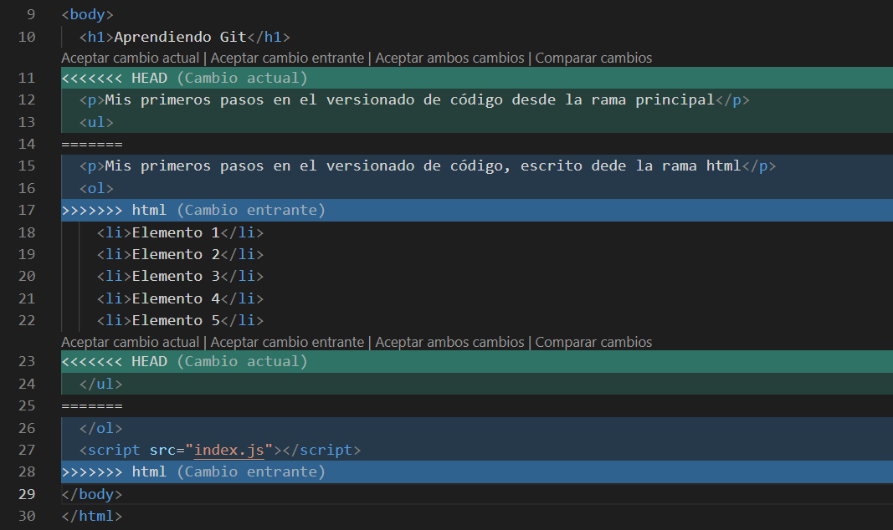
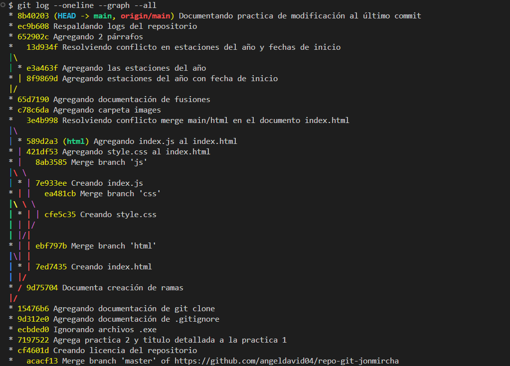

# Curso de _Git_ & _GitHub_ - jonmircha

Este es el repositorio de práctica utilizado para aprender los fundamentos de Git (software de versionado) y GitHub (plataforma en la nube). Esta iniciativa gratuita pertenece a [Jonmircha](https://www.youtube.com/@jonmircha)

## 🚀 Primera Práctica: Flujo básico de git y github

En esta fase inicial del curso, configuramos el entorno y establecimos el flujo de trabajo básico de Github.

### Requisitos previos:

Tener instalado Git
Cuenta activa en GitHub
Editor de código (recomendado: Visual Studio Code)

### Comandos iniciales ejecutados:

1. Inicialización: `git init` (para empezar a trackear la carpeta)

2. Configuración:

- `git config --global user.name "Tu Nombre"`
- `git config --global user.email "tu@email.com"`

3. Flujo de trabajo:

- git `add .`: Para pasar los archivos al Staging Area
- git `commit -m "Primer commit"`: Para registrar los cambios en la cabeza (HEAD) del repositorio

## 🌿 Segunda Práctica: Cambiar rama Master a Main

En esta segunda práctica se realiza el traslado de la rama Master por Main, en un repositorio ya existente y en uno [nuevo](https://github.com/angeldavid04/curso-git-main). En dicho repositorio se encuentra la explicación para iniciar repositorios con la rama main.

### Reemplazando master por main en GitHub

```bash
# Crea la rama local main y pásale el historial de la rama master
git branch -m master main

# Haz un push de la nueva rama local main en el repositorio remoto de GitHub
git push -u origin main


# Cambia el HEAD actual a la rama main
git symbolic-ref refs/remotes/origin/HEAD refs/remotes/origin/main
```

Después de ejecutar estos comandos, necesitas cambiar la rama por defecto en tu repositorio de GitHub, para ello puedes guiarte con este [recurso](https://docs.github.com/en/repositories/configuring-branches-and-merges-in-your-repository/managing-branches-in-your-repository/changing-the-default-branch) de la documentación oficial de GitHub.

## 😶‍🌫️ Tercera Práctica: Ignorando archivos con .gitignore

Para evitar que Git agregue ciertos archivos y carpetas que no queremos subir al repositorio, podemos utilizar un archivo llamado `.gitignore`.

Además de incluir nombres de archivos y carpetas, también es posible utilizar _comodines_. Por ejemplo:

```gitignore
# No rastrea los archivos con extensión .exe
*.exe
```

Las almohadillas (`#`) se utilizan dentro de los archivo `.gitignore` para definir comentarios.

Para generar automáticamente el contenido de un archivo `.gitignore` según tu proyecto, puedes utilizar el sitio [gitignore.io](https://www.toptal.com/developers/gitignore).

## 👥 Cuarta Práctica Clonando repositorios

`git clone` nos permite hacer una copia local de un repositorio, conservando su historial de cambios.

```bash
git clone https://github.com/usuario/repositorio.git
```

## 🪾 Quinta Práctica: Creación de ramas

`git branch nombre-rama` nos permite crear una nueva rama. Una rama es una versión alterna de nuestro proyecto y nos permiten trabajar distintas funciones en paralelo.

`git checkout nombre-rama` se utiliza para movernos de la rama actual, a la rama indicada.
`git checkout -b nombre-rama` nos permite crear una nueva rama y movernos a ella en un solo comando.

Otros comandos utiles son `git branch` para listar las ramas existentes y `git branch -d nombre-rama` para borrar una rama local.

Al momento de tener creada una rama, la puedes iniciar en el repositorio remoto y hacer push con `git push -u origin nombre-rama`

> [!WARNING]
> Es importante tener en cuenta que el contenido de las ramas toma en cuenta la rama actual en el momento en que se creo.

### Creando un rama js

```bash
git checkout -b js
git add . # Solo agrega el contenido de la rama js
git commit -m "Creando index.js"
git push -u origin js
```

## 🌲 Sexta Práctica: Fusión de ramas

**Fusionar** una rama consiste en unir el trabajo de una o varias ramas en una sola. Generalmente, vamos a querer agregar los cambios de otras ramas a la rama principal.

```bash
git checkout main # Rama principal
git merge html # Rama con la que se va a fusionar
git push
```

Fusionar ramas puede resultar en 2 tipos de fusión:

- **Fast-Forward:** la fusión no tiene conflictos, esto quiere decir que solo agrega cosas y no modifica algo que también existe en la otra rama.
- **Manual Merge:** Ambas ramas tienen conflictos en uno o varios cambios, por lo tanto la fusión ocurre de forma manual eligiendo lo que queremos conservar.



```bash
git checkout main
git merge html
# En este punto se abre el editor para resolver conflictos, corriges y guardas los cambios
git add . # Agregas los cambios sin conflictos
git commit -m "Fusionando rama main con html"
```

## 🩹 Septima Práctica: Modificando cambios del último commit

### Utilizando `commit --amend`

Para hacer modificaciones al último commit en el repositorio local podemos utilizar el parámetro `--amend`, el cual nos permite "enmendar" el último cambio que hayamos hecho.

- **Sin editar el mensaje del último commit:** `git commit --amend --no-edit`

- **Editando el mensaje del último commit:** `git commit --amend -m "Nuevo mensaje"`

> [!WARNING]
> Es importante tener especial cuidado al utilizar `--amend` cuando ya se ha hecho push, ya que en ese caso se tendrán que solucionar los conflictos con el repositorio remoto.

### Eliminando el último commit

El siguiente comando nos permite eliminar el último commit que hayamos hecho:

```bash
git reset --hard HEAD~1`
```

> [!WARNING]
> Hay que tener cuidado al utilizar operaciones de este tipo. No es aconsejable utilizarlas a la ligera debido a su naturaleza destructiva.

## Octava Práctica: Manejo del registro del historial

Conocer el manejo del historial nos permite conocer información de commits anteriores y el registro de todos los cambios.

### Ver commits anteriores

El comando `git checkout` también nos permite ver el estado como se encontraba el repositorio en un determinado commit, sin afectar ni realizar ningún cambio al repositorio.

```bash
git checkout id-commit
```

### Registro del historial

`git log` nos permite visualizar los cambios realizados en nuestro repositorio. Puede recibir algunos parámetros interesantes.

Los principales comandos que podemos utilizar con `git log` son los siguientes:

- `git log` - Muestra un historial detallado en la terminal, puedes utilizar q para salir y enter para ver más cambios de los que se muestran.

- `git log --oneline` - Muestra una versión simple de los cambios, mostrando un cambio por línea.

- `git log > commits.txt` - Guarda el historial actual en un archivo.

- `git log --oneline --graph --all` - `--graph` muestra el repositorio en forma de árbol, `--all` hace que se muestren los cambios de todas las ramas; en conjunto, se muestra todo el historial de cambios de forma ramificada.



#### Algunos comandos adicionales con `git log`

```bash
# muestra el historial con el formato que indicamos
git log --pretty=format:"%h - %an, %ar : %s"

# cambiamos la n por cualquier número entero y mostrará los n cambios recientes
git log -n

# muestra los cambios realizados después de la fecha especificada
git log --after="2019-07-07 00:00:00"

# muestra los cambios realizados antes de la fecha especificada
git log --before="2019-07-08 00:00:00"

# muestra los cambios realizados en el rango de fecha especificado
git log --after="2019-07-07 00:00:00" --before="2019-07-08 00:00:00"

# muestra todo el registro de acciones del log
# incluyendo inserciones, cambios, eliminaciones, fusiones, etc.
git reflog

# diferencias entre el Working Directory y el Staging Area
git diff
```

## 🔄 Octava Práctica: Reseteo del historial

### Conociendo git status

Antes de hacer una operación como `git reset`, podemos utilizar el comando `git status` para conocer el estado actual del _working directory_ y el _staging area_.

### Haciendo reset al historial

Podemos eliminar distintos puntos del historial utilizando el comando `git reset`

```bash
# borra el HEAD
git reset --soft

# borra HEAD y Staging
git reset --mixed

# borra todo: HEAD, Staging y Working Directory
git reset --hard

# deshace todos los cambios después del commit indicado, preservando los cambios localmente
git reset id-commit

# desecha todo el historial y regresa al commit especificado
git reset --hard id-commit
```

> [!WARNING]
> Es importante saber que estos comandos deben tomarse con mucha precaución al hacer trabajo colaborativo, ya que pueden ocasionar percances si no se manejan adecuadamente.

### Haciendo reset a un repositorio

Acciones como estás deben ser tomadas con pinzas, en especial cuando trabajas en un equipo de desarrollo, lo recomendable es usar estos comandos en repositorios personales.

Para reiniciar un repositorio, debes crear un respaldo del archivo config de la carpeta `.git`, luego borrar la carpeta `.git` e iniciar el repositorio con normalidad, con la diferencia de que se recupera el archivo de configuración. Si sigues el procedimiento anterior, no es necesario volver a configurar el repositorio remoto.

```bash
cd carpeta-repositorio
mv .git/config ~/saved_git_config # Se respalda .config en la carpeta del usuario actual
rm -rf .git
git init
git branch -M main
git add .
git commit -m "Commit inicial"
mv ~/saved_git_config .git/config # Se reemplaza el archivo .config con el respaldo
git push --force origin main # Fuerza los cambios al repositorio remoto
```

## 🏷️ Novena Práctica: Tags

Las **tags** o etiquetas nos permiten versionar nuestro código en un formato de versiones, generalmente empleando [versionamiento semántico](https://semver.org/lang/es/).

```bash
# listar etiquetas
git tag

# crear etiqueta
git tag numero-version

# eliminar una etiqueta
git tag -d numero-version

# mostrar información de una etiqueta
git show numero-version
```

### Sincronizando etiqueta

Para sincronizar la etiqueta del repositorio local al remoto, podemos utilizar los siguientes comandos:

```bash
git add .
git tag v1.0.0
git commit -m "v1.0.0"
git push origin numero-version
```

### Generando una etiqueta anotada

Las etiquetas anotadas son un objeto independiente guardado en la base de datos del repositorio, esto quiere decir que tienen más caracteristicas a comparación de las etiquetas usadas anteriormente.

```bash
git add .
git tag -a "v1.0.0" -m "Mensaje de la etiqueta"
git push --tags
```

### Versionando

Este commit es para oficializar nuestra versión **1.0.0**.

## 🔧 Cambio de prueba
